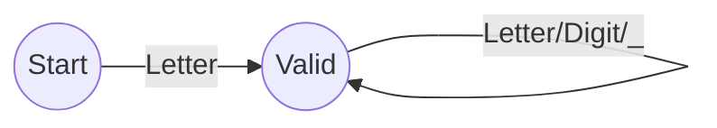
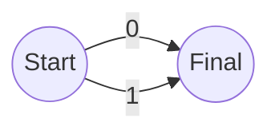

# LogicEval Language Specification

## 1. Introduction
LogicEval is a domain-specific language designed for evaluating boolean expressions and generating truth tables. It supports basic boolean operators, variable assignments, and inference rules.

## 2. Lexical Rules

### Tokens
| Token Name | Pattern | Description |
| :--- | :--- | :--- |
| `ID` | `[A-Za-z][A-Za-z0-9_]*` | Identifiers for variables and rules |
| `BOOL` | `0` \| `1` | Boolean literals |
| `AND` | `&` | Logical AND |
| `OR` | `\|` | Logical OR |
| `NOT` | `!` | Logical NOT |
| `IMPLIES` | `->` | Logical Implication |
| `LPAREN` | `(` | Left Parenthesis |
| `RPAREN` | `)` | Right Parenthesis |
| `SEMICOL` | `;` | Statement Terminator |
| `EQUAL` | `=` | Assignment Operator |
| `COLON` | `:` | Rule Definition Separator |
| `COMMA` | `,` | List Separator |
| `KW_EXPR` | `expr` | Keyword for expression evaluation |
| `KW_SET` | `set` | Keyword for variable assignment |
| `KW_TABLE` | `table` | Keyword for truth table generation |
| `KW_EVAL` | `eval` | Keyword for evaluating current state |
| `KW_INFER` | `infer` | Keyword for rule inference |

### Whitespace and Comments
- Whitespace (spaces, tabs, newlines) is ignored.
- Comments are not explicitly defined in the prompt but can be treated as whitespace if needed (e.g., `#` for single line). *Implementation decision: No comments for now as per prompt.*

## 3. Grammar (EBNF)

```ebnf
program         ::= stmt_list
stmt_list       ::= stmt stmt_list | ε
stmt            ::= expr_stmt | set_stmt | table_stmt | eval_stmt | rule_stmt | infer_stmt

expr_stmt       ::= "expr" expression ";"
set_stmt        ::= "set" ID "=" BOOL ";"
table_stmt      ::= "table" (ID)? ";"
eval_stmt       ::= "eval" ";"
rule_stmt       ::= ID ":" expression ";"
infer_stmt      ::= "infer" id_list ";"

expression      ::= implication
implication     ::= or_expr ("->" implication)?
or_expr         ::= and_expr ("|" and_expr)*
and_expr        ::= not_expr ("&" not_expr)*
not_expr        ::= "!" not_expr | primary
primary         ::= ID | "(" expression ")" | BOOL
id_list         ::= ID ("," ID)*
```

## 4. Semantics

### Types
- The only data type is Boolean (0 or 1).
- Variables are implicitly Boolean.

### Scoping and Variables
- Global scope for all variables.
- `set` command assigns a concrete value (0 or 1) to a variable.
- `eval` uses the currently assigned values to evaluate all stored expressions.
- `table` generates a truth table for the expression. If an ID is provided, it generates a table for that specific named rule or expression (if we store them). *Refinement: `table` without ID generates table for the last `expr` statement.*

### Inference
- `rule_stmt` defines a named logical rule.
- `infer` takes a list of rule names and evaluates them (placeholder for more complex inference logic, likely just evaluating the boolean value of the rules).

## 5. DFA Diagrams (Textual Representation)

### Identifier (ID)


### Boolean (BOOL)


### Operators
```mermaid
graph LR
    Start((Start)) -->|!| Not((NOT))
    Start -->|&| And((AND))
    Start -->|\|| Or((OR))
    Start -->|-| Dash
    Dash -->|>| Implies((IMPLIES))
```

## 6. Intermediate Representation (3AC)
The compiler generates 3-Address Code (3AC) for execution.
Format: `result = op arg1 arg2`

Example: `A & !B`
```
t1 = NOT B
t2 = AND A t1
```

## 7. Optimization
- **Constant Folding**: Pre-calculate operations with constant operands (e.g., `1 & 0` -> `0`).
- **Dead Code Elimination**: Remove instructions whose result is never used.
- **Identity/Null Laws**: `A & 1` -> `A`, `A | 0` -> `A`.
